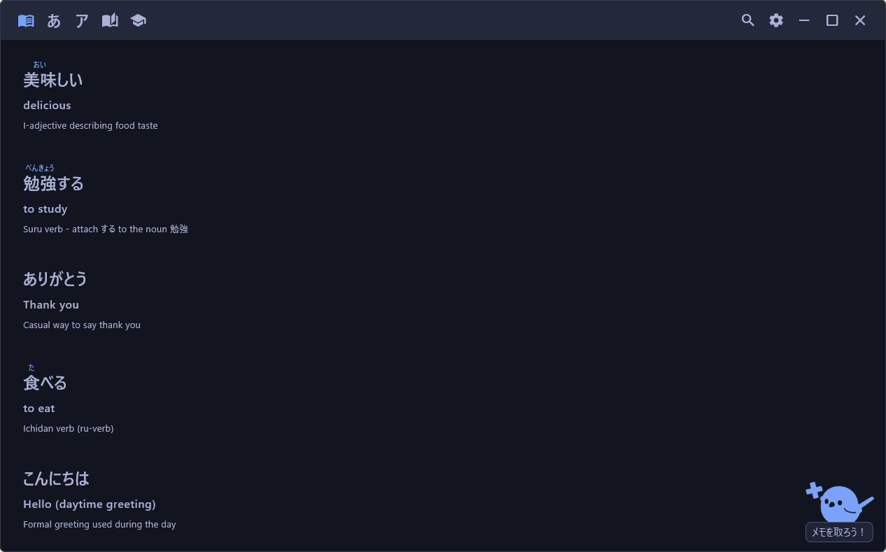
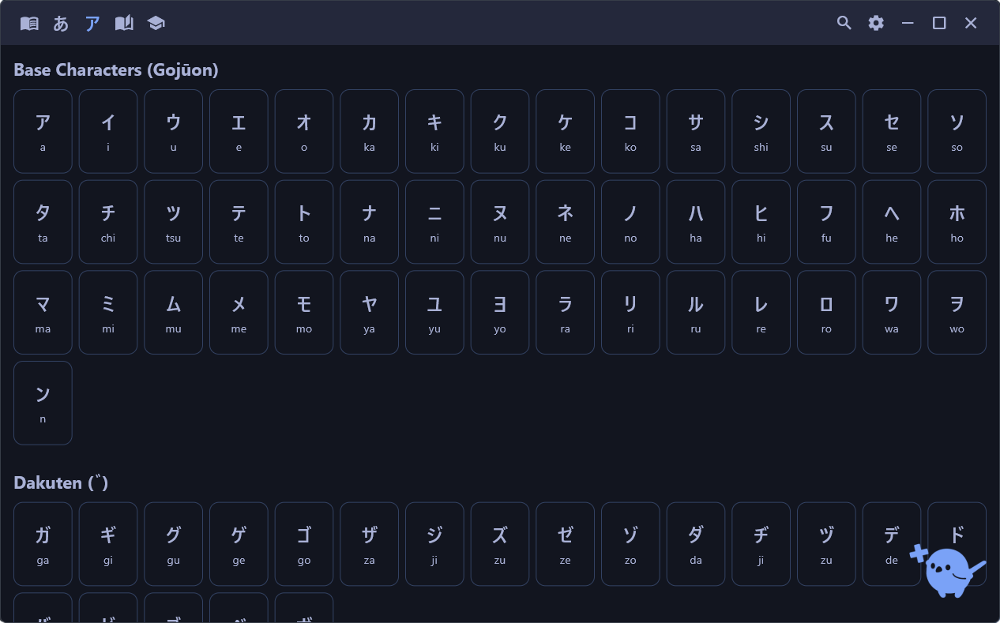
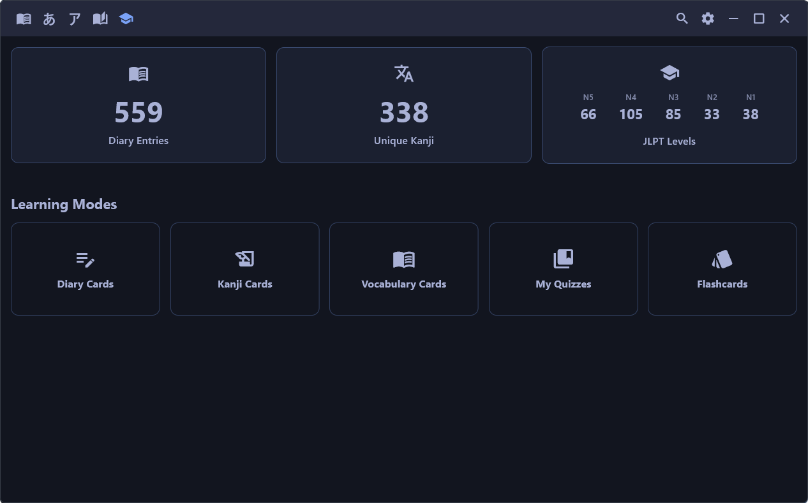
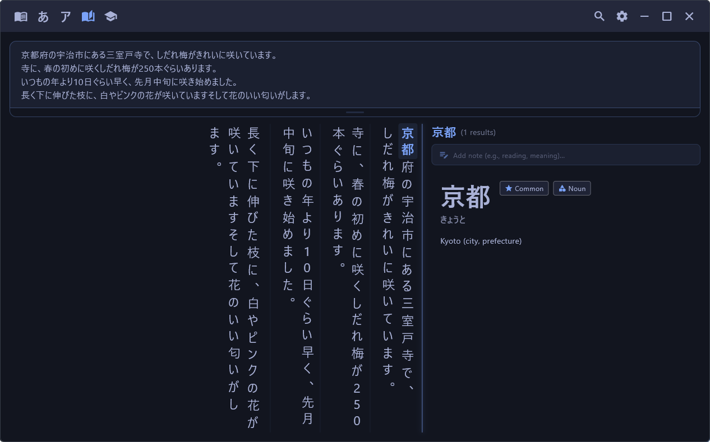
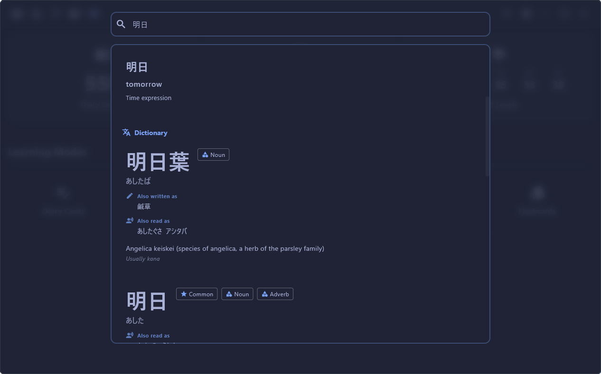

<div align="center">
  
  
# JPN Learning Diary
  
  A desktop app to track your Japanese language learning progress, take notes and practice.
  
  
  
</div>

---

## Features

JPN Learning Diary provides a dedicated space to manage your Japanese language journey. It features comprehensive Hiragana and Katakana dictionaries, along with a detailed Kanji reference containing over 6,000 characters with readings and JLPT levels. You can build a personal learning diary to track vocabulary, complete with furigana, meanings, and custom notes. To reinforce your studies, the app includes interactive quiz modes and a Study Mode for analyzing texts. Everything is stored locally on your device for fast, offline access. You can also sync your data between devices by placing the database file in a cloud-synced directory. On Android, this works via the Storage Access Framework, allowing you to access your database directly from supported cloud storage providers.

<div align="center">





</div>

## Installation

Download the latest release for your platform from the [Releases](https://github.com/spalter/jpn-learning-diary/releases) page.

> **Note:** As this is a personal open-source project built for my own use, the application is not signed with commercial certificates. Consequently, Windows, macOS, and Android will not recognize it as a valid source. You may encounter security warnings (such as "Unknown Publisher", "Unverified Developer", or "Install from unknown source") during installation. You will need to manually bypass these warnings to install the app or compile it yourself.

## Development

### Debugging

```bash
# Clone the repository
git clone https://github.com/spalter/jpn-learning-diary.git
cd jpn-learning-diary

# Get dependencies
flutter pub get

# Download the Words/Kanji data from kanjiapi.dev and converts it into a DB file that can
# be used by the JPN Learning Diary App.
./tools/convert.sh

# Run in debug mode
flutter run

# Example to run without window effects (for testing)
flutter run --dart-define=args=--no-effects
```

### Release Builds

```bash
# Windows
flutter build windows --release

# macOS
flutter build macos --release

# Linux
flutter build linux --release
```

The built application will be in:

- Windows: `build/windows/x64/runner/Release/`
- macOS: `build/macos/Build/Products/Release/`
- Linux: `build/linux/x64/release/bundle/`

## Credits

💜 Flutter [flutter.dev](https://flutter.dev/).<br>
💜 Takoboto [takoboto.jp](https://takoboto.jp/).<br>
💜 The Kanji dictionary is based on [kanjiapi.dev](https://kanjiapi.dev/). Huge props to them for compiling so much data and making it available.<br>
💜 The Word dictionary is based on [JMdict](https://www.edrdg.org/jmdict/j_jmdict.html).
